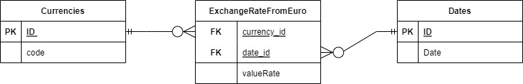

# Currency Exchange Rates
A simple program that consumes [this](https://www.bank.lv/vk/ecb_rss.xml) external API about currency exchange rates, stores the data in DB,
as well as creates endpoints to acquire the newest rates and specific currency history rates.

## Database Schema
To see the exact SQL query navigate to src/main/resources/db/migration folder.


## How To Run
Firstly, you need to open the terminal in projects root dir. and run the command below. It will create database migration as well as request data from the external api and insert it into the DB.
```
./mvnw clean compile java:exec@start-database
```
Secondly, you run this command to start the server.
```
./mvnw clean compile java:exec@start-server
```

## Endpoints
`localhost:7070/currencies` - returns the newest currency exchange rates

`localhost:7070/currencies/{currency}` - return specified currencies exchange rate history